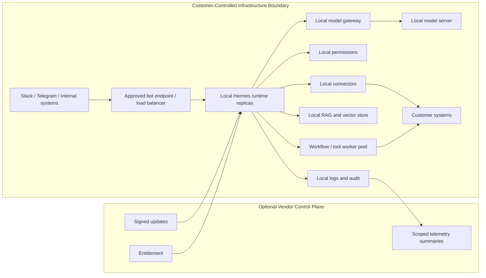

# Full On-Prem Appliance

Full On-Prem Appliance moves the agent runtime and supporting services inside the customer-controlled infrastructure boundary.

Use this strategy when the deployment boundary requires local processing for runtime, retrieval, connectors, logs, and model inference.

## Deployment Boundary

| Component | Location |
| --- | --- |
| Agent runtime | Customer-controlled infrastructure boundary |
| Channel adapters | Customer-controlled infrastructure boundary or customer-approved network path |
| RAG / retrieval | Customer-controlled infrastructure boundary |
| Connectors | Customer-controlled infrastructure boundary |
| Model inference | Customer-controlled infrastructure boundary |
| Logs and audit | Customer-controlled infrastructure boundary, with scoped telemetry only if approved |
| Updates | Managed channel, scheduled bundle, or offline package |

## Use When

- Data cannot leave the customer-controlled infrastructure boundary.
- Runtime must execute on customer-controlled infrastructure.
- Retrieval, prompt assembly, connector actions, and logs must stay local.
- The customer can provide an admin owner, hardware profile, and update window.
- Offline or restricted-network operation is required.

## Avoid When

- Local inference alone satisfies the requirement.
- Isolated Cloud Tenant satisfies the isolation requirement.
- The customer cannot support the required local infrastructure.
- The update and rollback process cannot be agreed in advance.

## Clarify First

- What data, logs, telemetry, or metadata may leave the customer-controlled infrastructure boundary?
- Are updates online, scheduled, or offline-only?
- Who owns local backups, restore, and hardware replacement?
- What package format is acceptable: containers, binaries, appliance image, or managed hardware?
- What access is available for debugging and emergency rollback?

Cross-strategy assumptions are in the [Technical Appendix](/deployment-strategies/technical-appendix).

## Deployment Topology

Customers keep one approved channel endpoint. Runtime replicas and worker capacity scale inside the customer-controlled infrastructure boundary.

