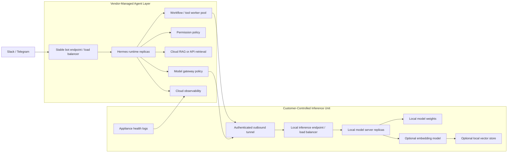

# Hybrid Local Inference

Hybrid Local Inference keeps the agent deployment vendor-managed while routing model calls to a customer-controlled inference endpoint.

This strategy is only about where model execution happens. It should not be treated as a full data-residency model unless retrieval, prompt assembly, permissions, logs, and runtime placement are also moved local.

## Deployment Boundary

| Component | Default location |
| --- | --- |
| Agent runtime | Vendor-managed cloud tenant |
| Channel adapters | Vendor-managed cloud tenant |
| RAG / retrieval | Vendor-managed cloud tenant unless explicitly moved local |
| Prompt assembly | Vendor-managed cloud tenant unless explicitly moved local |
| Model inference | Customer-controlled inference endpoint |
| Logs and observability | Vendor-managed summaries plus local appliance logs |

## Locality Levels

| Level | What moves local | What it means |
| --- | --- | --- |
| Local model only | Model server and weights | Model execution happens inside the customer-controlled boundary, but orchestration may remain vendor-managed. |
| Local retrieval | Embeddings, vector store, selected RAG sources | Retrieval can stay inside the customer-controlled boundary, but vendor-managed cloud may still coordinate the workflow. |
| Local prompt assembly | Permission checks, retrieval, prompt assembly | Stronger data boundary, more local operational responsibility. |
| Full local runner | Runtime, tools, RAG, model gateway | This becomes Full On-Prem Appliance. |

## Use When

- The customer specifically requires local model execution.
- The customer can host and maintain a model endpoint or appliance.
- Vendor-managed cloud orchestration is still acceptable.
- Full local processing is not required.

## Avoid When

- The customer means "no data leaves premises."
- The customer cannot support a local appliance or model endpoint.
- Network policy prevents a reliable authenticated connection between cloud and customer site.
- The support boundary for the local unit is undefined.

## Clarify First

- Is the requirement local inference, local retrieval, local prompt assembly, or full local processing?
- What data may pass through the vendor-managed cloud tenant?
- Who owns appliance uptime and network access?
- How are local model updates handled?
- What happens if the local model endpoint is unavailable?

Cross-strategy assumptions are in the [Technical Appendix](/deployment-strategies/technical-appendix).

## Deployment Topology

Customers keep one Slack or Telegram bot. A load-balanced cloud endpoint scales Hermes orchestration separately from the customer-controlled inference endpoint.

