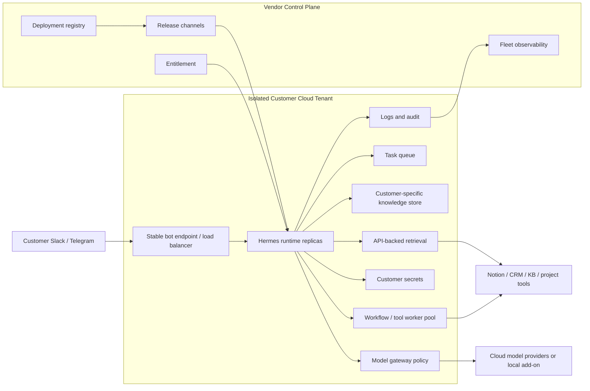

# Isolated Cloud Tenant

Isolated Cloud Tenant gives each customer a customer-specific vendor environment for the agent runtime and deployment state.

This pattern is still vendor-managed cloud. The difference from Managed Cloud Runtime is the strength and shape of the customer-specific boundary.

The implementation could be a VPS, VPC, cloud project, cloud account, dedicated cluster, or equivalent. Those are implementation choices inside this pattern, not separate deployment patterns.

The tenant does not need to copy every customer system into its own RAG store. It can use a customer-specific knowledge store, customer APIs, or both, depending on the customer's data-boundary and freshness requirements.

## Deployment Boundary

| Component | Location |
| --- | --- |
| Agent runtime | Customer-specific vendor environment |
| Channel adapters | Customer-specific vendor environment |
| RAG / retrieval | Customer-specific knowledge store, customer APIs, or both |
| Connectors | Customer-specific vendor environment calling approved customer APIs |
| Secrets | Customer-specific secret store |
| Model inference | Cloud model provider, with local add-on possible |
| Logs and observability | Customer-specific, with allowed central summaries |

## Use When

- The customer needs stronger isolation for runtime, secrets, RAG, logs, or connectors.
- Customer APIs are available, but access should be mediated from an isolated tenant.
- The deployment uses real customer data.
- Debugging, rollback, and cost attribution need to be customer-specific.
- The customer does not require processing inside the customer-controlled infrastructure boundary.
- The deployment still needs centralized update control.

## Avoid When

- Managed Cloud Runtime satisfies the customer trust and isolation requirement.
- The customer requires all data and runtime to stay inside the customer-controlled infrastructure boundary.
- The team cannot provision tenants repeatably.
- The customer's infrastructure requirements would make each tenant unique.

## Clarify First

- What must be isolated: runtime, RAG, secrets, logs, connectors, or all of them?
- Which systems are queried live through customer APIs, and which are indexed into the tenant?
- Can observability data leave the tenant?
- Are model calls shared through a central gateway or isolated per customer?
- What isolation mechanism is required: VPS, VPC, cloud project, cloud account, dedicated cluster, or equivalent?
- How are connector updates rolled out?
- What is the rollback target for runtime, connector, RAG, and model-policy changes?

Cross-strategy assumptions are in the [Technical Appendix](/deployment-strategies/technical-appendix).

## Deployment Topology

Customers keep one Slack or Telegram bot. A load-balanced endpoint routes traffic to Hermes runtime replicas and worker capacity inside the isolated tenant.

