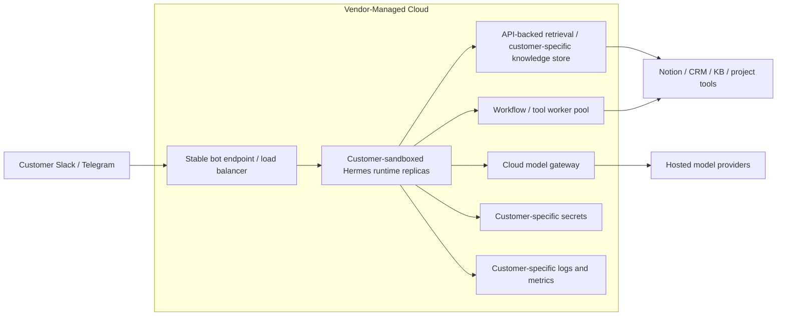

# Managed Cloud Runtime

Managed Cloud Runtime runs Hermes in vendor-managed cloud while provisioning a sandboxed runtime boundary for each customer.

This is the standard cloud deployment pattern. It should use common images, common automation, and shared vendor operations, but it should not use a shared unsandboxed agent process across customers.

The implementation could use Kubernetes namespaces, containers, VMs, or another isolation mechanism. That choice is an implementation detail inside this pattern.

## Deployment Boundary

| Component | Location |
| --- | --- |
| Agent runtime | Vendor-managed cloud, sandboxed per customer |
| Channel adapters | Vendor-managed cloud, sandboxed per customer |
| RAG / retrieval | Customer APIs or vendor-hosted customer-specific knowledge store |
| Connectors | Vendor-managed cloud with customer-specific credentials |
| Secrets | Customer-specific secret boundary |
| Model inference | Cloud model provider |
| Logs and observability | Vendor-managed cloud with customer-specific access boundaries |

## Use When

- The customer permits vendor-managed cloud processing.
- Customer systems expose the required APIs.
- Data-residency requirements are light or not yet in scope.
- The deployment can begin with a limited set of channels, users, or systems.
- The customer does not require a customer-specific VPS, VPC, cloud account, or on-prem boundary.
- The team needs the lowest-overhead repeatable deployment pattern.

## Avoid When

- The customer requires a stronger customer-specific vendor environment.
- Customer documents cannot be indexed or processed outside the customer-controlled infrastructure boundary.
- The customer requires local inference.
- The customer expects full data residency or on-prem processing inside their own boundary.
- Required integrations need heavy custom connector work before the agent can operate.

## Clarify First

- Which customer systems can be accessed through APIs?
- Will documents be indexed into vendor-managed cloud infrastructure?
- What prompt, trace, and audit data may be stored?
- Are customer permissions enforced in the source systems, the agent layer, or both?
- What sandbox mechanism is sufficient for this customer: namespace, container, VM, or equivalent?
- What is the rollback path if an API permission or connector breaks?

Cross-strategy assumptions are in the [Technical Appendix](/deployment-strategies/technical-appendix).

## Deployment Topology Graph

Customers keep one Slack or Telegram bot. A load-balanced endpoint routes traffic to Hermes runtime replicas and worker capacity behind the scenes.

