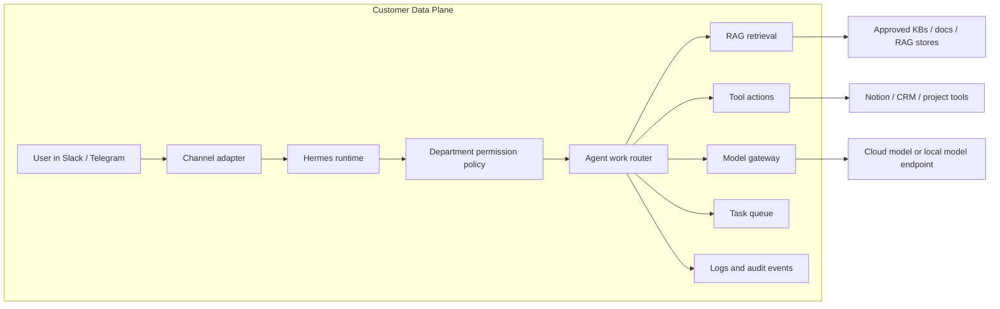
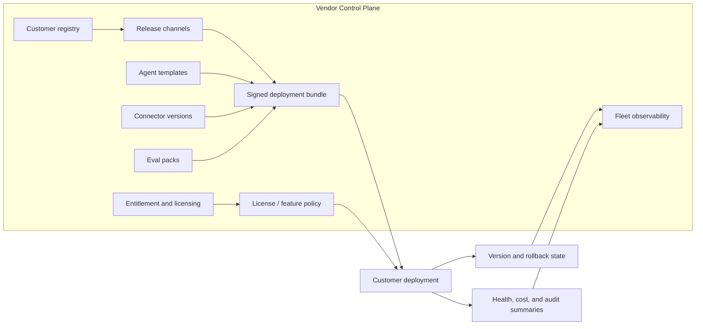

# Technical Appendix

This appendix contains details that may inform deployment strategy but should not be treated as confirmed facts about the vendor, customers, sales motion, or operating model.

## Assumptions

The assumptions below are included only because they can change the deployment recommendation.

| Assumption | Why it matters to deployment strategy |
| --- | --- |
| Deployments should be updateable across customer instances. | Push updates, rollback, release channels, and version tracking become deployment requirements. |
| Some deployments may become repeatable SaaS onboarding later. | Manual deployment steps should be captured in a way that can later become automation. |
| Some customers may require local inference. | The architecture needs a path for model calls to route to customer-controlled hardware. |
| Some customers may require full local processing. | Runtime, RAG, connectors, logs, and inference may need to move inside the customer-controlled infrastructure boundary. |
| Department-level permissions matter. | Retrieval and tool access must respect customer permission boundaries. |
| Customer systems include Slack, Telegram, Notion, CRMs, KBs, project tools, and RAG stores. | Connector placement and data indexing strategy depend on these systems. |

If any assumption is wrong, the deployment recommendation should be revisited.

## Pattern vs Implementation

Deployment patterns describe who controls the runtime boundary and where inference/data movement happens. Implementation choices describe how a pattern is built.

| Implementation lever | What it can support |
| --- | --- |
| Kubernetes namespace | Managed Cloud Runtime or Isolated Cloud Tenant, depending on network, secret, storage, and runtime separation. |
| Container or pod sandbox | Managed Cloud Runtime when each customer runtime is isolated by deployment automation. |
| VM or VPS | Isolated Cloud Tenant when a customer-specific vendor environment is required. |
| VPC, cloud project, or cloud account | Isolated Cloud Tenant when stronger network, billing, audit, or blast-radius boundaries are required. |
| Customer-site appliance | Hybrid Local Inference or Full On-Prem Appliance, depending on whether only inference or the full runtime moves local. |

## Unit Economics Assumptions

Assumption: deployment cost is driven less by the model call alone and more by the work required to launch, operate, update, and debug each customer instance.

These inputs should be measured per deployment mode, not treated as fixed facts.

| Cost input | Managed Cloud Runtime | Isolated Cloud Tenant | Hybrid Local Inference | Full On-Prem Appliance |
| --- | --- | --- | --- | --- |
| Setup labor | Lowest if integrations are API-ready | Higher due to customer-specific environment provisioning | Higher due to appliance registration | Highest due to customer-controlled infrastructure |
| Fixed infrastructure | Shared vendor infrastructure with per-customer sandboxing | Customer-specific vendor environment cost | Vendor-managed tenant plus appliance cost | Customer-controlled infra plus packaging |
| Model cost | Cloud provider usage | Cloud provider usage by tenant | Local unit utilization plus fallback policy | Local/customer-managed model cost |
| Knowledge maintenance | API-backed or vendor-hosted | Customer-specific knowledge store and/or APIs | Cloud or local depending on boundary | Local only |
| Connector maintenance | Shared connector path | Customer-specific connector config | Tenant plus appliance/network path | Local connector deployment |
| Debugging effort | Lowest access friction | Customer-specific but observable | Crosses cloud/local boundary | Highest access friction |
| Update effort | Centralized | Release rings by tenant | Cloud update plus appliance channel | Scheduled, signed, or offline updates |
| Rollback effort | Centralized | Tenant rollback target | Tenant plus appliance rollback | Customer-local rollback plan |

Questions to measure:

- How many implementation hours are required before first production use?
- Which costs recur per customer even if usage is low?
- Which costs scale with messages, documents, users, connectors, or model calls?
- Which failure modes require engineering intervention?
- Which deployment mode has the fastest safe rollback?
- Which deployment mode can be updated without customer-specific coordination?

## Runtime Data Plane

Assumption: the agent receives requests through chat channels and then acts through approved customer systems.

## Management Control Plane

Assumption: the vendor needs to update and observe multiple customer deployments from one management layer.

## Deployment Guarantees

Assumption: these are useful comparison points for deployment selection. They should be verified against customer requirements before being used as promises.

| Property | Managed Cloud Runtime | Isolated Cloud Tenant | Hybrid Local Inference | Full On-Prem Appliance |
| --- | --- | --- | --- | --- |
| Central updates | Yes | Yes, through tenant rings | Yes, plus appliance channel | Signed, scheduled, or offline-capable |
| Runtime isolation | Per-customer sandbox on vendor-managed cloud | Customer-specific vendor environment | Vendor-managed tenant plus customer-controlled inference unit | Customer-controlled infrastructure boundary |
| Local inference | No | Optional add-on | Yes | Yes |
| Data stays inside customer-controlled boundary | No | No | Only if RAG, prompt assembly, permissions, and runtime move local | Yes, if telemetry is scoped |
| Customer secrets | Customer-specific secret boundary | Customer-specific vault | Customer-specific vault plus appliance identity | Customer-managed or local vault |
| Bare-metal path | No | No | Appliance only | Yes |

## Deployment Runbook Assumptions

Assumption: every deployment strategy benefits from producing comparable operating evidence, even when the topology changes.

- **Preflight:** customer owner, departments, workflows, channels, tools, data sources, compliance claim, expected volume, and human escalation path.
- **Channel setup:** Slack / Telegram app registration, bot scopes, channel allowlist, webhook or socket mode, token storage, and test messages.
- **Permission model:** department roles, tool scopes, RAG collection access, CRM/project-tool boundaries, break-glass admin, and audit owner.
- **Ingestion:** source inventory, sync cadence, index location, permission-aware retrieval, stale document handling, and deletion propagation.
- **Acceptance tests:** support, lead-management, and project-management golden tasks; bad-permission tests; hallucination/escalation tests; latency and cost thresholds.
- **Rollout:** canary users or channels, launch window, dashboards watched, rollback owner, and customer communications template.
- **Rollback:** previous runtime bundle, previous connector version, model policy pin, RAG snapshot, and token revoke/disable path.
- **Support model:** SLA tier, log access, incident categories, customer IT owner, upgrade window, and known unsupported requests.
- **Cost controls:** per-tenant budget, model spend alerts, connector/API limits, and local inference utilization.

## Deployment-Specific Assumptions

### Isolated Cloud Tenant

Assumption: a customer-specific vendor environment is the unit of isolation.

Assumption: the isolated tenant can still use customer APIs. Isolation means the agent runtime, secrets, logs, and deployment state are customer-specific; it does not require every source system to be copied into the tenant.

- versioned infrastructure-as-code
- customer-specific secrets
- per-tenant logs, traces, and metrics
- release-ring enrollment
- connector version inventory
- RAG snapshot and rebuild path
- model policy pinning
- budget and usage alerts
- rollback target for runtime, connector, and model policy

### Hybrid Local Inference

Assumption: customer-site inference is exposed to the cloud deployment through an authenticated connection.

- mTLS between cloud and appliance
- signed appliance identity
- short-lived scoped credentials
- per-customer rate limits
- audit logs on both sides
- remote disable / revoke path
- signed updates for appliance software

### Full On-Prem Appliance

Assumption: the customer accepts operational responsibility for infrastructure inside the customer-controlled boundary.

- approved hardware profile
- named customer admin owner
- maintenance window policy
- backup and restore plan
- outbound telemetry policy
- signed offline update path
- support SLA and escalation path
- local audit retention policy
- acceptance eval pack

Assumption: on-prem software is packaged as signed, versioned artifacts rather than raw repositories. The local package should include only the components required to run the customer deployment.
